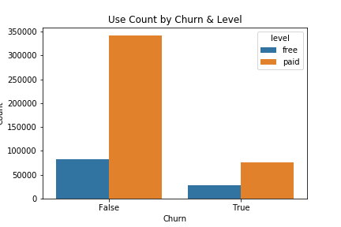
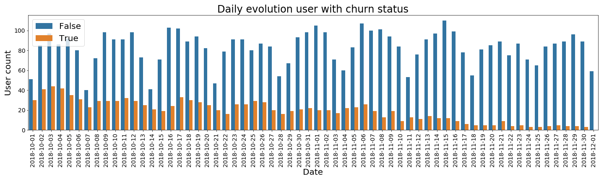
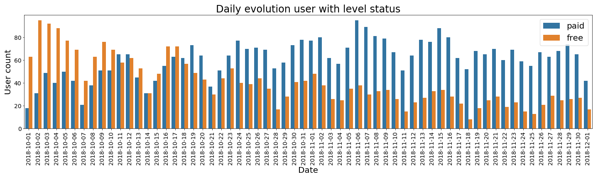
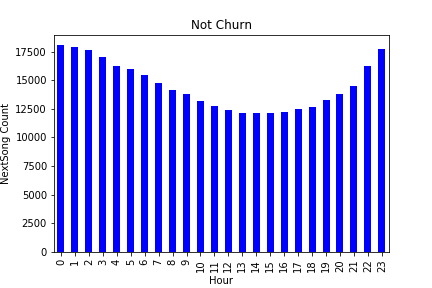
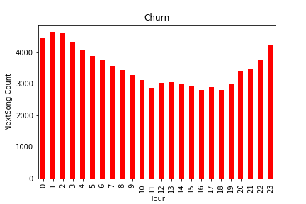

# Sparkify Churn Prediction

The following provides a quick overview of the methodologies and results obtained from the churn prediction. For the full code, results and explanation of methodologies, refer to [Sparkify_Churn_Prediction.ipynb](Sparkify_Churn_Prediction.ipynb)


## Table of Contents
* [1. Business Problem](#problem)
  - [Defining Churn](#churn)
  - [Why is Churn a problem?](#why)
* [2. Approach](#approach)
  - [Data Exploration](#explore)
  - [Feature Engineering](#feature)
  - [Modelling](#model)
* [3. Results](#result)
  - [Evaluation Metrics](#eval)
* [4. Value Proposition](#value)


## 1. Business Problem <a id="problem">

### Defining Churn <a id="churn">

> **Customer churn** is a tendency of customers to abandon a brand and stop being a paying client of a particular business. The percentage of customers that discontinue using a company’s products or services during a particular time period is called a customer churn (attrition) rate.

#### Churn in Sparkify Context

For this project, we will define **churn** as when a user cancels the service. In the dataset, this is identified as having a value of ```Cancellation Confirmation``` under column ```page```.

### Why is Churn a problem? <a id="why">

Churn is a problem for Sparkify as it represents revenue lost from subscribers who leave the platform. There is revenue lost from subscribers who previously paid for the subscription. There is also revenue lost from free subscribers since there is less to be made through others revenue streams such as advertisement.

### Business Objective

Thus, the challenge is to identify these potential churn users before they actually cancel their subscription, so that we might employ appropriate countermeasure to prevent churn.

## 2. Approach <a id="approach">

### Data Exploration <a id="explore">

For more information on the decision process behind preprocessing and variable selection, refer to [Sparkify_Churn_Prediction.ipynb](Sparkify_Churn_Prediction.ipynb). There are significant number of missing values in the dataset for multiple columns. However, these have been identified to be systematic, so dropping missing ```userId``` would fix many of the associated problems.

Below are some overview findings for the dataset.

- 543705 Rows (Actions)
- 449 Distinct users, of which 99 are Churn







### Feature Engineering <a id="feature">

For our final dataset, we want each row to correspond to a single user. The raw dataset is a log of past usage, so we will need to conduct feature engineering in order to obtain user-specific single-values which can be used for modelling.

We introduce the following variables to be included:
- Gender (binary)
- Paid (binary)
- Daily Number of Sessions (continuous)
- Monthly Number of Sessions (continuous)
- Daily Number of Songs (continuous)
- Monthly Number of Songs (continuous)
- Days since Registration (continuous)
- Number of Artists (continuous)
- Number of Friends (continuous)
- Number of Thumbsdown (continuous) (continuous)
- Number of Thumbsup (continuous)
- Number of songs added to Playlist (continuous)
- Average Session time (continuous)
- Number of upgrades (continuous)
- Number of downgrades (continuous)

### Modelling <a id="model">

I will be using 3-fold CV to choose the best parameters for each model. The reason for using CV is because of the relative small number of data points. This will be executed by ```train_model```. Subsequently, ```eval_model``` will provide preliminary evaluation metrics for each model. Finally ```plot_feature_importance``` will load the best saved model and display the ranks of feature importance for each model.

We will be looking at four machine learning algorithms with the following hyperparameter configurations:
- <u>Logistic Regression</u>
    - ElasticNet Parameter : (0, 0.1, 0.5, 1.0)
    - Regularization Parameter : (0, 0.05, 0.1)


- <u>Decision Tree Classifier</u>
    - Impurity : (Entropy, Gini)
    - Max Depth : (2, 4, 6, 8)


- <u>Gradient Boosted Tree Classifier</u>
    - Max Iterations : (10, 20, 30)
    - Max Bins : (20, 40, 60)
    - Max Depth : (2, 4, 6, 8, 10)


- <u>Random Forest Classifier</u>
    - Impurity :  (Entropy, Gini)
    - Max Depth : (2, 4, 6, 8)

## 3. Results <a id="result">

### Evaluation Metrics <a id="eval">

##### ROC (Receiver Operating Characteristic)

ROC is a plot of TPR against FPR for various threshold values. Skillful models are represented by curves that bow up to the top left of the plot. A no skill classifier cannot discriminate between classes and is represented by the diagonal line from bottom left to top right with Area under Curve (AUC) of 0.5.

##### Precision
Precision can be understood as answerinf the following question: **What proportion of positive identifications was actually correct?**

##### Recall
Recall can be understood as answering the following questions: **What proportion of actual positives was identified correctly?**

Since, precision and recall are naturally in tension, we take a look at the **Precision-Recall curve** to jointly evaluate our model on these two metrics. The reason why we are particularly interested in jointly observing precision and recall is because we have a case of class imbalance here. Given our business objective to identify churn users, we are lessinterested in predicting the non-churn than we are in predicting the churn.

A model with perfect skills is represented by a curve that bows toward (1,1). A no-skill classifier cannot discriminate between classes and would predict random or constant class, and changes based on the distribution of classes.

We also look at the AUC, which sumamrizes the skill of the model across various thresholds.

Here is a quick preview of the results of the various models:


#### Confusion Matrices

To provide a projection of the value that churn identification brings to Sparkify, it is first necessary to breakdown the our identifications according to actual and predicted labels. In order to do so, we use confusion matrices to give us an overview of our identification performance, and we will use the best performing model as a baseline case for subsequent valuation.

The confusion matrices are as follows:


The confusion matrices are particularly useful because in our business case, we are not merely interested in accuracy, but we are more concerned about identifying churn users, while perhaps also taking into account factors such as retention costs, which we will be explore below.

## 4. Value Proposition <a id="value">

Based on our best performing model, for every  100  customers who will cancel in the future, we can identify  90  of them beforehand.

Admittedly, this is an optimistic estimate of the model performance. However, we will see later that even with more conservative assumptions about model performance, the revenue gains from churn identification are still strong.

To provide a realistic estimate of the valuation, we must consider the gain in revenue in the scope of revenue that is already gained from non-churn users. To do so, we must get an idea of the breakdown of users grouped by paying/free and churn/no-churn.

| Paying / Free | Churn  | Proportion  |
|:-:|:-:|:-:|
| Paying  | Churn  | 17%  |
| Paying  | Non-Churn  | 55%  |
| Free  | Non-Churn  | 23%  |
| Fre   | Churn  | 5%  |

Roughly speaking,
- ```prop_F``` proportion of free users within churn users = 25\%
- ```prop_P``` proportion of paying users within churn users = 75\%
- ```churn_prop``` proportion of churn users within all users = 22\%
- ```nochurn_P_prop``` proportion of non-churn paying users within all users = 55\%
- ```nochurn_P_prop``` proportion of non-churn paying users within all users = 23\%

For now, we assume that for every 1 dollar earned from free users (```rev_F```), 3 dollars are earned from paying users (```rev_P```). We take ```rev_F``` as the baseline numeraire for easy comparison.

**Estimates**
- Revenue loss before identification:  $250
- Revenue loss after identification:  $25
- Revenue loss prevented:  $225
- Revenue before identification:  $855
- Revenue after identification:  $1080
- **Percentage Increase in Revenue after identification:  26 %**

For our best model, for every 90 true positives identified, there were 33 false negatives, so this would represent additional costs and should be captured in our model as well, depending on how we want to define the cost of targetting potential churn users. This cost will differ according to what kind of strategies we want to use to intervene for retention.

Let us assume for now that targetting costs will be 0.1 of revenue gained from free users.

- Cost of Targetting Potential Churn:  $12.3
- Revenue after identification AND Targetting Cost:  $1067
- **Percentage Increase in Revenue after identification AND Targetting Cost:  25 %**

To take our valuation estimation further, let us explore how drastically our revenue percentage increases are affected when we change key assumptions about our parameters.

In particular, let's take a look at what happens when we change our ```identification_rate``` as an indicator of identifying potential churn.


From above, we see that even if our model does not hit the 90% identification rate that we claim it does there are still significant gains to be made even for lower identification rates. The revenue-drive case for identifying churn users is clear.

I also conducted a sensitivity analysis to see how the relative revenues from paid and free users affect the total revenue streams. It turns out that due to the nature of class imbalance, that is not a very influencial factor for revenue increases.
